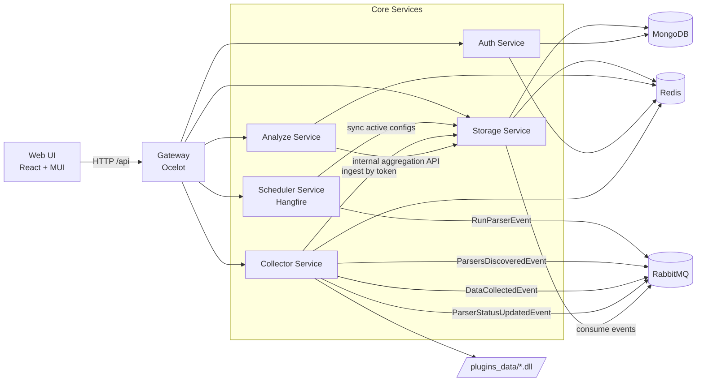
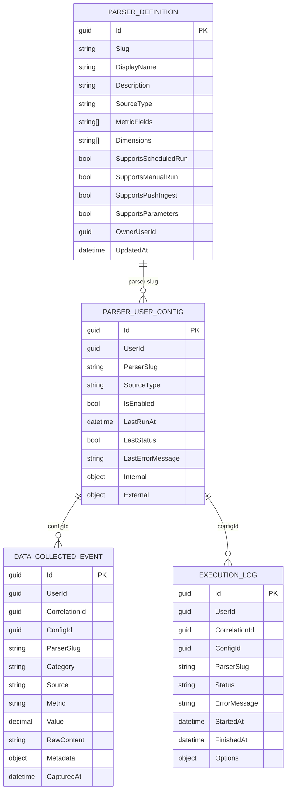

# Flow Aggregate


Flow Aggregate is a microservices data platform for collecting, normalizing, storing, and interpreting time-series signals from heterogeneous sources. It was built as a graduation project, but the implementation follows production-oriented engineering patterns: API gateway routing, event-driven integration, isolated services, health checks, OAuth2 authentication, scheduled execution, plugin extensibility, and AI-assisted analytics.

It is designed around a universal ingestion pipeline:

- Internal parsers execute on-demand or on schedule.
- External systems can push events into the platform through token-protected ingest endpoints.
- RabbitMQ coordinates asynchronous workflows between services.
- MongoDB persists operational state and historical measurements.
- Redis accelerates hot-path reads, task status tracking, and analytics caching.
- The React portal gives operators a single control plane for auth, parser management, data history, charts, and health monitoring.

> **💡 Pro Tip:** There are two frontend run modes in this repository:
> `docker compose up` starts a containerized frontend on `http://localhost:3000`, while `npm run dev` in `src/web-ui` starts the Vite developer server on `http://localhost:5173`.

## Table of Contents

- [Why Flow Aggregate](#why-flow-aggregate)
- [Quick Start](#quick-start)
- [Architecture](#architecture)
- [Data Model (MongoDB)](#data-model-mongodb)
- [Microservices](#microservices)
- [Analyze Service: Deterministic Analytics Before AI](#analyze-service-deterministic-analytics-before-ai)
- [Frontend Portal](#frontend-portal)
- [Configuration Reference](#configuration-reference)
- [Deployment](#deployment)
- [API Surface](#api-surface)
- [BI Layer (Metabase)](#bi-layer-metabase)
- [Innovation Highlights](#innovation-highlights)
- [Tech Stack](#tech-stack)
- [Project Structure](#project-structure)
- [Current Status](#current-status)

## Why Flow Aggregate

Flow Aggregate combines several architectural ideas into one cohesive platform:

- **Event-driven choreographies via AMQP** for decoupled ingestion, persistence, and orchestration.
- **Heterogeneous polyglot persistence** with MongoDB for durable document storage and Redis for transient, latency-sensitive state.
- **Asynchronous polling with context isolation** so analytics, UI, and scheduling can evolve independently without duplicating raw data.
- **Runtime parser extensibility** through internal parser discovery and external plugin DLL loading.
- **Deterministic analytics + LLM interpretation** where mathematical signals are calculated first, then summarized by OpenAI with the API key kept server-side.

This makes the project suitable both for academic defense and for demonstrating how a modern data platform can be decomposed into independently deployable services.

## Quick Start

### Prerequisites

- Docker Desktop with Compose v2
- Node.js 20+ and npm 10+ for local frontend development
- Available ports: `3000`, `5050`, `5672`, `15672`, `27017`, `6379`, `27170`, `5173`
- A Google OAuth client for sign-in
- An OpenAI API key if you want AI insights enabled

### 1. Copy Environment Templates

```bash
cp .env.example .env
cp src/web-ui/.env.example src/web-ui/.env
```

PowerShell:

```powershell
Copy-Item .env.example .env
Copy-Item src/web-ui/.env.example src/web-ui/.env
```

### 2. Fill Required Variables

Minimum required backend variables in `.env`:

- `JWT__KEY`: symmetric signing key for JWT access and refresh token workflows. Use a random secret of at least 32 characters.
- `GOOGLE__CLIENT_ID`: Google OAuth client ID used by `AuthService` to validate Google identity tokens.
- `GOOGLE__CLIENT_SECRET`: Google OAuth client secret paired with the client ID above.
- `OpenAI__ApiKey`: server-side credential used by `AnalyzeService` to call the OpenAI API for semantic summaries.

Minimum required frontend variables in `src/web-ui/.env`:

- `VITE_GOOGLE_CLIENT_ID`: browser-side Google OAuth client ID for the React login flow.
- `VITE_API_BASE_URL`: gateway base URL used by Axios. For local backend via Docker, use `http://localhost:5050/api`.

> **⚠️ Important:** `VITE_GOOGLE_CLIENT_ID` should match the same Google OAuth application configured for the backend. For Vite development, Google OAuth origins must include `http://localhost:5173`. For the containerized frontend, add `http://localhost:3000`.

### 3. Start the Full Backend + Containerized Frontend

```bash
docker compose up -d --build
```

After the stack is healthy:

- API Gateway: `http://localhost:5050`
- Frontend (containerized): `http://localhost:3000`
- RabbitMQ Management: `http://localhost:15672`
- Mongo Express: `http://localhost:27170`

### 4. Run the Frontend in Vite Dev Mode

If you prefer hot reload and local frontend debugging:

```bash
cd src/web-ui
npm install
npm run dev
```

This starts the frontend on `http://localhost:5173`.

Recommended `src/web-ui/.env` value for local development:

```env
VITE_API_BASE_URL=http://localhost:5050/api
```

### 5. Verify the Platform

- Open the portal and sign in with Google OAuth.
- Visit the health page in the UI to confirm service reachability.
- Run a parser manually or enable a scheduled parser configuration.
- Inspect RabbitMQ, Mongo Express, and analytics charts to validate the full event flow.

## Architecture

The architecture separates concerns into ingress, orchestration, persistence, analytics, authentication, and presentation. Ocelot centralizes public routing, RabbitMQ carries asynchronous service events, and services communicate through explicit contracts rather than shared databases.



### Architectural Commentary

- **Gateway-first ingress:** public clients talk only to Ocelot, which keeps service boundaries clean and public routes centralized.
- **Message-first background workflow:** Scheduler and Collector emit events, while Storage consumes them to materialize system state.
- **Read-path isolation:** Analyze does not own raw data persistence; it derives analytics from Storage’s internal aggregation API.
- **Operational resilience:** Redis is used for short-lived state and cache acceleration, reducing pressure on MongoDB for frequently repeated reads.
- **Extension boundary:** new parser capabilities can be introduced by dropping plugin assemblies into `plugins_data` without modifying the Collector codebase.

## Data Model (MongoDB)

The persistence model captures parser definitions, user-specific configurations, collected measurements, and execution history. This enables both operational workflows and downstream analytics without requiring schema rewrites for each new metric source.



### Model Commentary

- `PARSER_DEFINITION` acts as the canonical parser catalog for internal, plugin, and user-defined sources.
- `PARSER_USER_CONFIG` stores per-user activation, scheduling, status, and parser-specific settings.
- `DATA_COLLECTED_EVENT` preserves time-series measurements together with dimensions in `Metadata`, enabling flexible filtering without rigid relational migrations.
- `EXECUTION_LOG` gives the platform an auditable trail for runtime diagnostics, latency analysis, and operator-facing history views.

## Microservices

### Gateway

The Ocelot gateway exposes the public API surface and hides internal service topology from clients. It is the single entry point for the React portal and for any future external integrations.

### Auth Service

Auth Service handles identity verification and session lifecycle:

- Validates Google ID tokens on sign-in.
- Issues JWT access tokens and refresh tokens.
- Supports token refresh for sliding-session UX.
- Stores user profile data and refresh state in MongoDB/Redis-backed flows.

### Collector Service

Collector Service is the ingress engine of the platform:

- Discovers internal parsers through reflection.
- Loads external parser plugins from `plugins_data` at runtime.
- Publishes parser catalog updates through `ParsersDiscoveredEvent`.
- Executes parsers when `RunParserEvent` arrives.
- Accepts token-protected external push ingestion through `/collector/ingest`.
- Emits `DataCollectedEvent` and parser status events with correlation IDs.

This service forms the ingestion edge of the system and supports both pull-based and push-based integration patterns.

### Storage Service

Storage Service is the system of record:

- Consumes RabbitMQ events and persists historical measurements.
- Stores parser definitions and user parser configurations.
- Tracks execution status and merges running-state visibility from Redis with durable history from MongoDB.
- Exposes internal aggregation endpoints for history, metrics, statistics, and dimension options.
- Validates schedule definitions and supports user-owned external parser configurations.

This service is intentionally central to persistence but not to orchestration, keeping data durability separate from execution concerns.

### Analyze Service

Analyze Service builds deterministic insight layers on top of Storage:

- Pulls canonical time-series data from Storage internal APIs.
- Computes trend, dispersion, forecast, and descriptive statistics.
- Caches short-lived analytics results in Redis to reduce repeated query cost.
- Produces AI-assisted textual summaries only after deterministic metrics are assembled.

Its role is not raw storage but mathematically consistent interpretation of stored observations.

### Scheduler Service

Scheduler Service uses Hangfire to orchestrate recurring execution:

- Synchronizes active parser configurations from Storage.
- Translates schedules into recurring jobs.
- Publishes `RunParserEvent` messages to RabbitMQ.

This creates a clean separation between schedule ownership and parser execution.

## Analyze Service: Deterministic Analytics Before AI

One of the strongest engineering characteristics of Flow Aggregate is that OpenAI is not used as a calculator. The platform first computes a deterministic analytics context, then passes those results to the LLM for natural-language interpretation.

### Deterministic metrics calculated before OpenAI

- **Ordinary Least Squares (OLS) linear trend:** computes slope and intercept over the ordered time series.
- **Coefficient of Determination (R²):** measures how well the linear model explains the observed variance.
- **Volatility via Coefficient of Variation (CV):** normalizes standard deviation against the absolute mean to express relative variability.
- **Momentum evaluation using adaptive time-windows:** compares recent slope against earlier slope segments to classify acceleration, deceleration, or stability.
- **Descriptive statistics:** includes average, min, max, first value, last value, median, Q1 quartile, Q3 quartile, delta from average, and percent change.
- **Interquartile spread analysis:** the quartile set enables robust spread interpretation and future-ready IQR-based reasoning.
- **Forecast generation:** builds a configurable horizon using the fitted linear trend and an interval-sensitive step.
- **3-sigma anomaly detection:** the platform flags the latest value as anomalous when it exceeds three standard deviations from the baseline mean, reducing false positives compared to a looser `2σ` rule.

### Why this matters

- The analytics pipeline remains explainable and testable.
- AI output is grounded in computed facts rather than raw prompts.
- Expensive LLM calls are reserved for semantic interpretation, not for basic statistics.
- The same deterministic layer can feed dashboards, alerts, BI tools, or future rule engines without requiring OpenAI.

## Frontend Portal

The frontend lives in `src/web-ui` and serves as the operator console for the platform. It is built with **React 19**, **TypeScript**, **Vite**, **Material UI**, **TanStack Query**, **Zustand**, and **MUI X Charts**.

### Frontend capabilities

- Google OAuth sign-in wired to backend-issued JWT and refresh tokens.
- Dashboard views for overview, metrics, history, parser management, and analytics.
- Health monitoring UI that polls service health endpoints.
- Chart-driven analysis views for trend, volatility, forecast, and historical series.
- Dimension-aware filtering for parser metadata slices.

### Frontend engineering notes

- **Vite** provides fast local development and production bundling.
- **Zustand** manages lightweight global state for auth, parsers, health, and UI concerns.
- **Axios with interceptors** attaches access tokens automatically and performs queued refresh-token recovery when concurrent `401` responses occur.
- **Sliding-expiration style UX** is achieved by keeping the access token in `sessionStorage` and refresh token state in persisted auth storage.
- **MUI X Charts** powers high-performance visualizations for historical and predictive views.

### Local frontend commands

```bash
cd src/web-ui
npm install
npm run dev
npm run build
npm run lint
npm run preview
```

### UI Screenshots


## Configuration Reference

### Backend `.env`

| Variable | Required | Purpose |
|---|---|---|
| `JWT__KEY` | Yes | HMAC signing key used to issue and validate JWT access and refresh token flows. |
| `JWT__ISSUER` | Recommended | Logical issuer name embedded in tokens. |
| `JWT__AUDIENCE` | Recommended | Logical audience checked during token validation. |
| `JWT__AT_LIFETIME_HOURS` | Recommended | Access-token lifetime in hours. |
| `JWT__RT_LIFETIME_DAYS` | Recommended | Refresh-token lifetime in days. |
| `GOOGLE__CLIENT_ID` | Yes | Google OAuth client identifier used by the backend to validate Google ID tokens. |
| `GOOGLE__CLIENT_SECRET` | Yes | Google OAuth client secret used for the server-side OAuth integration. |
| `MONGO__DB` | Recommended | Primary application database name. |
| `MONGO__ROOT_USER` | Yes | MongoDB root/admin username for local container startup. |
| `MONGO__ROOT_PASS` | Yes | MongoDB root/admin password for local container startup. |
| `ConnectionStrings__Mongo` | Yes | MongoDB connection string consumed by services. |
| `RABBITMQ__HOST` | Yes | RabbitMQ hostname visible from containers. |
| `RABBITMQ__USER` | Yes | RabbitMQ application user. |
| `RABBITMQ__PASS` | Yes | RabbitMQ application password. |
| `REDIS__HOST` | Yes | Redis hostname visible from containers. |
| `REDIS__PORT` | Yes | Redis port mapping and connection port. |
| `REDIS__PASS` | Yes | Redis password used by the container and services. |
| `HANGFIRE__USER` | Recommended | Hangfire dashboard username if the dashboard is exposed. |
| `HANGFIRE__PASS` | Recommended | Hangfire dashboard password if the dashboard is exposed. |
| `OpenAI__ApiKey` | Optional but required for AI insights | Secret key used by `AnalyzeService` when generating OpenAI summaries. |

### Frontend `src/web-ui/.env`

| Variable | Required | Purpose |
|---|---|---|
| `VITE_GOOGLE_CLIENT_ID` | Yes | Google OAuth client ID injected into the browser for the React login flow. |
| `VITE_API_BASE_URL` | Yes | Gateway API base URL used by Axios, typically `http://localhost:5050/api` in local development. |

## Deployment

### Standard local deployment

```bash
docker compose up -d --build
```

This starts:

- Gateway on `5050:8080`
- Frontend on `3000:80`
- RabbitMQ on `5672`
- RabbitMQ Management on `15672`
- MongoDB on `27017`
- Redis on `${REDIS__PORT}:6379`

### Azure-oriented port mapping

```bash
docker compose -f docker-compose.yml -f docker-compose.azure.yml up -d --build
```

In this variant, the gateway is exposed on `http://localhost:80`.

### Deployment checklist

1. Copy and populate `.env` and `src/web-ui/.env`.
2. Ensure Google OAuth origins include whichever frontend host you use.
3. Provide `OpenAI__ApiKey` if AI summaries are required.
4. Confirm port availability before building the stack.
5. Verify service health before testing parser execution.

## API Surface

Public routes through the gateway:

- `/api/auth/*` for authentication and token lifecycle.
- `/api/collector/*` for parser execution and external ingestion.
- `/api/storage/*` for parser configuration and historical data access.
- `/api/analyze/*` for deterministic analytics and AI summaries.

Internal-only route family:

- `/internal/storage/*` for inter-service read operations used by Analyze and orchestration flows.

## BI Layer (Metabase)

The repository does not currently deploy Metabase, but the platform is BI-ready by design:

- Historical records are persisted in a stable document structure.
- Metrics carry parser slug, metric name, capture time, and metadata dimensions for slicing.
- Execution logs enable operational dashboards such as success rate, run latency, and error concentration.

Recommended integration path:

1. Deploy Metabase as a separate container or service.
2. Connect MongoDB as the reporting source.
3. Build dashboards over `collected_data` and `execution_logs`.

## Innovation Highlights

### 1. Dynamic Plugins

- External parser DLLs can be added without recompiling core services.
- Collector discovers and publishes parser metadata automatically.
- This creates a practical extension model for third-party ingestion capabilities.

### 2. Metadata Dimensions

- Time-series events can carry arbitrary metadata dimensions.
- Storage and Analyze support dimension-based slicing over `Metadata.*`.
- This enables flexible analytics without repeated schema migration work.

### 3. AI Insights

- OpenAI integration is server-side only; the browser never sees the secret.
- Deterministic metrics are assembled first, then summarized by the LLM.
- Result caching helps contain token usage and repeated request cost.
- The default configured model is `gpt-4o-mini`.

## Tech Stack

| Layer / Service | Language | Framework / Runtime | Storage | Messaging | Key Libraries |
|---|---|---|---|---|---|
| Gateway | C# | ASP.NET Core + Ocelot | - | - | Ocelot |
| Auth Service | C# | ASP.NET Core (.NET 10) | MongoDB, Redis | - | Google.Apis.Auth, System.IdentityModel.Tokens.Jwt |
| Collector Service | C# | ASP.NET Core (.NET 10) | Redis (task state) | RabbitMQ | reflection-based parser loading |
| Storage Service | C# | ASP.NET Core (.NET 10) | MongoDB, Redis | RabbitMQ | MongoDB.Driver, MassTransit, NCrontab |
| Analyze Service | C# | ASP.NET Core (.NET 10) | Redis cache, Storage API | - | custom analytics services, OpenAI HTTP integration |
| Scheduler Service | C# | ASP.NET Core (.NET 10) + Hangfire | MongoDB | RabbitMQ | Hangfire, Hangfire.Mongo |
| Web Portal | TypeScript | React 19 + Vite + MUI | Browser state | HTTP API | Zustand, Axios, TanStack Query, MUI X Charts |
| Optional BI | - | Metabase | MongoDB | - | dashboards and reporting |

## Project Structure

```text
src/
├── server/
│   ├── Gateway/             # Ocelot API Gateway
│   ├── AuthService/         # Google OAuth2 + JWT
│   ├── CollectorService/    # Parser execution and push ingest
│   ├── StorageService/      # Durable state and historical data
│   ├── AnalyzeService/      # Deterministic analytics + AI summaries
│   ├── SchedulerService/    # Hangfire recurring orchestration
│   └── Common/              # Shared contracts and abstractions
└── web-ui/                  # React 19 + TypeScript + Vite portal
```

Additional directories:

- `plugins_data/` for external parser assemblies loaded by Collector.
- `docs/` for README visual assets such as screenshots.

## Current Status

Flow Aggregate demonstrates:

- Modular data ingestion from internal parsers and external push sources.
- Asynchronous orchestration through RabbitMQ and MassTransit.
- Managed parser lifecycle with schedule-aware execution.
- Dimension-based analytics over a flexible event document model.
- AI-assisted summaries built on deterministic calculations.
- An extensible architecture appropriate for further BI, alerting, or plugin growth.

For a diploma defense, this is more than a set of parsers. It is a full, extensible data platform with a credible production-style architecture and a clear separation of operational responsibilities.

---

**[Українська версія](./README.uk.md)** for a synchronized Ukrainian reference.
