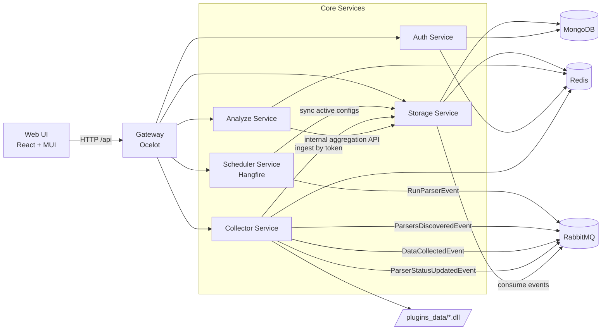
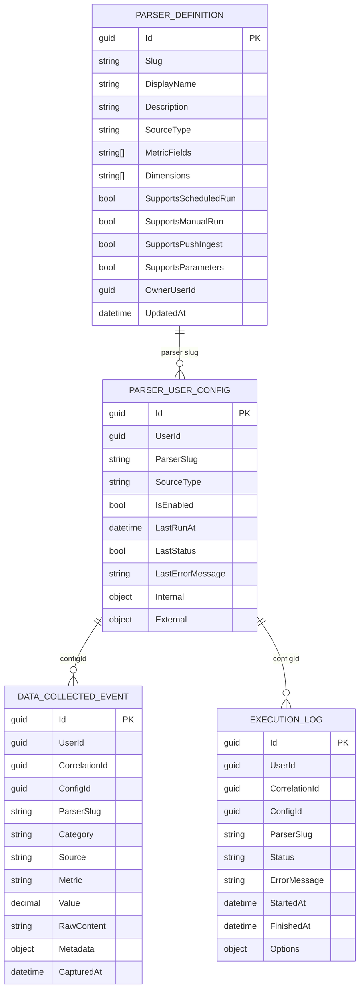

# Flow Aggregate

Мікросервісна платформа збору, зберігання та аналітики даних для дипломного проєкту.

Система побудована навколо ідеї універсального ingestion-конвеєра:

- джерела даних підключаються через внутрішні парсери або зовнішні push-інтеграції;
- обробка і синхронізація виконуються асинхронно через RabbitMQ;
- дані та виконання зберігаються в MongoDB;
- аналітика, тренди, волатильність та базовий forecasting надаються окремим сервісом;
- доступ для клієнта централізовано через API Gateway.

Проєкт знаходиться на етапі полірування дипломної роботи, але вже має робочий контур production-like архітектури з Health Checks, auth, кешуванням і scheduler-ом.

## Architecture



## Data Model (MongoDB)



## Microservices

### Collector Service

Відповідає за запуск парсерів та прийом зовнішнього ingest-потоку.

Ключові обов'язки:

- завантаження internal parser-ів через reflection;
- динамічне підключення зовнішніх plugin DLL з каталогу plugins_data;
- публікація discovered parser catalog в RabbitMQ;
- запуск парсера через RunParserEvent;
- прийом external push через /collector/ingest (token-based);
- публікація DataCollectedEvent + ParserStatusUpdatedEvent.

Особливості:

- підтримка Metadata та Dimensions на рівні parser-атрибутів;
- correlationId проходить весь pipeline;
- Redis використовується для live-статусів поточних задач.

### Storage Service

Центральний сервіс стану системи та історичних даних.

Ключові обов'язки:

- збереження подій DataCollectedEvent і статусів виконання;
- каталог парсерів (internal/plugin/external);
- user-конфігурації парсерів (manual/scheduled/push);
- task history з об'єднанням Mongo (completed) + Redis (running);
- aggregation API для Analyze:
	- history,
	- stats,
	- metric list,
	- dimension options.

Особливості:

- динамічні фільтри по Metadata.{dimension};
- валідація cron для schedule-конфігів;
- підтримка user-owned external parser definitions.

### Analyze Service

Окремий шар аналітики поверх Storage.

Ключові обов'язки:

- обчислення історичних рядів та агрегованої статистики;
- тренд-аналіз (slope, direction, R2);
- волатильність (std dev, coefficient of variation);
- простий лінійний прогноз (forecast horizon);
- dimension-aware аналітика через query-параметри.

Особливості:

- агрегації не дублюють дані, а читають internal endpoints Storage;
- короткочасний кеш в Redis знижує навантаження при повторних запитах.

## Frontend Portal

Фронтенд розташований у src/web-ui (React + TypeScript + Vite + MUI).

Що реалізовано:

- auth flow через Google OAuth + JWT/refresh;
- централізований API client на Axios з auto-refresh token;
- dashboard з overview/metrics/history/data/management;
- parser management:
	- каталоги парсерів,
	- конфіги запуску,
	- ручні запуски,
	- моніторинг статусів;
- аналітичні віджети на MUI X Charts:
	- history,
	- stats,
	- trend,
	- volatility,
	- forecast;
- dimension-aware фільтри для метрик.

### UI Screenshots (placeholders)


## BI Layer (Metabase)

На поточний момент Metabase не піднятий у docker-compose цього репозиторію, але архітектура вже сумісна з BI-підходом:

- Storage формує стабільні історичні колекції для репортингу;
- метрики мають parserSlug, metric, capturedAt, metadata для зрізів;
- execution logs дають операційні KPI (success rate, latency, error trends).

Рекомендований сценарій:

1. Підняти Metabase окремим контейнером.
2. Підключити MongoDB як data source.
3. Побудувати дашборди по колекціях collected_data та execution_logs.

## Innovation Highlights

### 1) Dynamic Plugins

- Collector завантажує сторонні parser DLL динамічно під час старту.
- Новий parser можна додати без зміни основного коду сервісу.
- Discovery-механізм автоматично публікує описи нових парсерів у каталог.

### 2) Metadata Dimensions

- Кожен запис даних може містити Metadata (ключ-значення).
- Analyze/Storage підтримують dimension filters поверх Metadata.*.
- Це дозволяє будувати багатовимірні зрізи без складних міграцій схеми.

### 3) AI Insights (planned)

У проєкті вже є підготовлена аналітична база для AI-шару, але повноцінні AI Insights наразі ще не реалізовані.

Планується додати:

- авто-інтерпретацію трендів і аномалій;
- семантичні summary по часових рядах;
- рекомендації щодо якості даних і налаштувань parser-ів.

## Tech Stack

| Layer / Service | Language | Framework / Runtime | Storage | Messaging | Key Libraries |
|---|---|---|---|---|---|
| Gateway | C# | ASP.NET Core + Ocelot | - | - | Ocelot |
| Auth Service | C# | ASP.NET Core (.NET 10) | MongoDB, Redis | - | Google.Apis.Auth, System.IdentityModel.Tokens.Jwt |
| Collector Service | C# | ASP.NET Core (.NET 10) | Redis (task state) | RabbitMQ | TinyMapper, reflection-based plugin loading |
| Storage Service | C# | ASP.NET Core (.NET 10) | MongoDB, Redis | RabbitMQ | MongoDB.Driver, MassTransit.RabbitMQ, NCrontab |
| Analyze Service | C# | ASP.NET Core (.NET 10) | Redis cache, Mongo via Storage API | - | custom analytics services |
| Scheduler Service | C# | ASP.NET Core + Hangfire | MongoDB (Hangfire storage) | RabbitMQ | Hangfire, Hangfire.Mongo, NCrontab |
| Web Portal | TypeScript | React 19 + Vite + MUI | Browser state (Zustand) | HTTP API | Axios, React Query, MUI X Charts |
| BI (optional) | - | Metabase | MongoDB | - | Metabase dashboards |

## Deployment (Docker Compose)

### 1. Prerequisites

- Docker Desktop (with Compose v2)
- Вільні порти: 5050, 5672, 15672, 27017, 6379, 27170

### 2. Environment setup

Скопіюй env-шаблони:

```bash
cp .env.example .env
cp src/web-ui/.env.example src/web-ui/.env
```

Для PowerShell (Windows):

```powershell
Copy-Item .env.example .env
Copy-Item src/web-ui/.env.example src/web-ui/.env
```

Заповни мінімум:

- JWT__KEY
- GOOGLE__CLIENT_ID
- GOOGLE__CLIENT_SECRET

### 3. Start backend stack

```bash
docker compose up -d --build
```

Корисні URL:

- Gateway API: http://localhost:5050
- RabbitMQ Management: http://localhost:15672
- Mongo Express: http://localhost:27170

### 4. Optional Azure-oriented port mapping

```bash
docker compose -f docker-compose.yml -f docker-compose.azure.yml up -d --build
```

У цьому режимі Gateway публікується на 80:8080.

### 5. Frontend run (dev)

```bash
cd src/web-ui
npm install
npm run dev
```

Примітка: Gateway CORS у поточній конфігурації дозволяє origin http://localhost:3000.
Якщо Vite стартує на іншому порту (наприклад 5173), або зміни порт dev-сервера, або онови CORS policy в Gateway.

За замовчуванням фронтенд працює з VITE_API_BASE_URL=http://localhost:5000/api.
Для поточного compose (Gateway на 5050) зазвичай зручно встановити:

```env
VITE_API_BASE_URL=http://localhost:5050/api
```

## API Surface (через Gateway)

- /api/auth/*
- /api/collector/*
- /api/storage/*
- /api/analyze/*

Internal маршрути для сервісної взаємодії:

- /internal/storage/* (доступні тільки через внутрішній gateway порт)

## Current Status

Проєкт вже функціонально демонструє:

- модульний ingestion даних;
- асинхронну оркестрацію через broker;
- керовані parser-конфіги;
- dimension-based analytics;
- готовність до розширення BI та AI шаром.

Для дипломного захисту це показує не просто набір парсерів, а повноцінну extensible data platform з практичною архітектурою.
