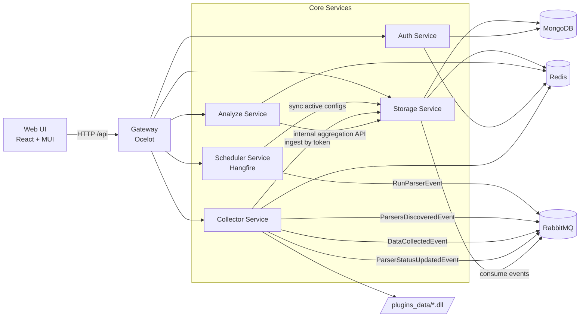
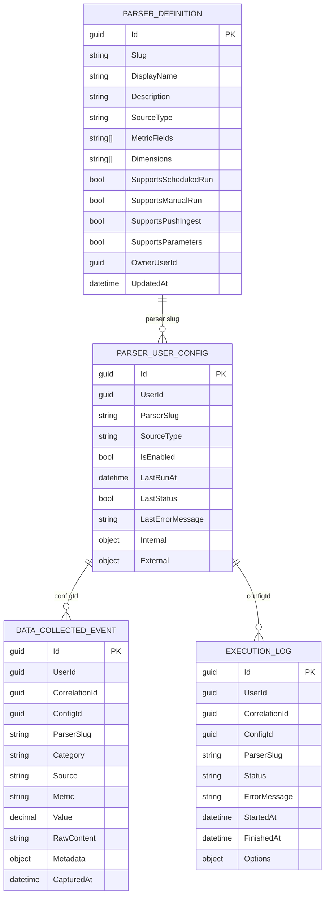

# Flow Aggregate

Microservices platform for data collection, storage, and analytics (diploma project).

A universal ingestion pipeline:
- Connect data sources via internal parsers or external push integrations
- Async processing & orchestration via RabbitMQ
- MongoDB for data persistence + Redis for caching
- Analytics layer: trends, volatility, forecasting
- Centralized access via API Gateway + React portal

Production-ready architecture: health checks, OAuth2, scheduler (Hangfire), plugin system.

---

## Quick Start

### Prerequisites
- Docker Desktop (Compose v2)
- Available ports: 5050, 5672, 15672, 27017, 6379, 27170

### 1. Setup Environment
```bash
cp .env.example .env
cp src/web-ui/.env.example src/web-ui/.env
```
Or PowerShell:
```powershell
Copy-Item .env.example .env
Copy-Item src/web-ui/.env.example src/web-ui/.env
```

Fill in required values:
- `JWT__KEY` – random 32+ char string
- `GOOGLE__CLIENT_ID` – OAuth app ID
- `GOOGLE__CLIENT_SECRET` – OAuth secret

### 2. Start Backend
```bash
docker compose up -d --build
```

**Useful URLs:**
- API Gateway: http://localhost:5050
- RabbitMQ: http://localhost:15672 (guest/guest)
- Mongo Express: http://localhost:27170
 - Frontend Health Page: http://localhost:5173/health

### 3. Start Frontend
```bash
cd src/web-ui
npm install
npm run dev
```

Frontend runs on `http://localhost:5173` (configurable).

**CORS note:** Default Gateway config allows `http://localhost:3000`. If Vite uses a different port, update `.env`:
```env
VITE_API_BASE_URL=http://localhost:5050/api
```

---

## Architecture



## Data Model (MongoDB)



---

## Microservices

### Collector Service

Responsible for parser execution and external ingest intake.

**Key responsibilities:**
- Load internal parsers via reflection
- Dynamically load external plugin DLLs from `plugins_data` directory
- Publish discovered parser catalog via RabbitMQ
- Execute parsers via RunParserEvent
- Accept external push via `/collector/ingest` (token-based)
- Publish DataCollectedEvent + ParserStatusUpdatedEvent

**Features:**
- Metadata and Dimensions support at parser attribute level
- CorrelationId flows through entire pipeline
- Redis caches live task statuses

### Storage Service

Central service for system state and historical data.

**Key responsibilities:**
- Persist DataCollectedEvent and execution statuses
- Parser catalog (internal/plugin/external)
- User parser configurations (manual/scheduled/push)
- Task history combining Mongo (completed) + Redis (running)
- Aggregation API for Analyze:
  - history
  - stats
  - metric list
  - dimension options

**Features:**
- Dynamic filters by Metadata.{dimension}
- Cron validation for scheduled configs
- Support for user-owned external parser definitions

### Analyze Service

Analytics layer on top of Storage.

**Key responsibilities:**
- Compute historical time series and aggregated statistics
- Trend analysis (slope, direction, R²)
- Volatility (std dev, coefficient of variation)
- Simple linear forecast (horizon configurable)
- Dimension-aware analytics via query parameters

**Features:**
- Aggregations don't duplicate data—read from Storage internal endpoints
- Short-lived Redis cache reduces load on repeated queries

### Scheduler Service

Hangfire-based recurring job orchestration.

**Key responsibilities:**
- Trigger parser runs on schedule
- Sync active parser configurations
- Publish RunParserEvent to RabbitMQ

### Auth Service

Google OAuth2 and token management.

**Key responsibilities:**
- Validate Google ID tokens
- Issue JWT access/refresh tokens
- Token refresh endpoint
- User profile management

---

## Frontend Portal

Frontend located in `src/web-ui` (React + TypeScript + Vite + MUI).

**Implemented:**
- Auth flow via Google OAuth + JWT/refresh
- Centralized Axios API client with auto-token-refresh
- Dashboard: overview, metrics, history, data, management
- Parser management:
  - Parser catalogs
  - Run configurations
  - Manual runs
  - Status monitoring
- Analytics widgets (MUI X Charts):
  - history
  - stats
  - trend
  - volatility
  - forecast
- Dimension-aware metric filters

- Health dashboard: service status and health checks UI (frontend polls `/health/{service}` endpoints)

### UI Screenshots (placeholders)


---

## BI Layer (Metabase)

Metabase is not currently deployed in this repo's docker-compose, but the architecture is BI-ready:

- Storage maintains stable historical collections for reporting
- Metrics have parserSlug, metric, capturedAt, metadata for slicing
- Execution logs provide operational KPIs (success rate, latency, error trends)

**Recommended approach:**
1. Deploy Metabase in a separate container
2. Connect MongoDB as data source
3. Build dashboards from `collected_data` and `execution_logs` collections

---

## Innovation Highlights

### 1) Dynamic Plugins

- Collector dynamically loads third-party parser DLLs at startup
- Add a new parser without modifying service code
- Discovery mechanism automatically publishes parser descriptions to the catalog

### 2) Metadata Dimensions

- Each data record can include Metadata (key-value)
- Analyze/Storage support dimension filters over Metadata.*
- Enables multi-dimensional slicing without complex schema migrations

### 3) AI Insights (Implemented with OpenAI)

The project integrates OpenAI gpt-4o-mini to generate AI-powered analytics summaries.

**Implementation:**
- Combines trend analysis, volatility, forecast, and metric statistics into a single analytics context
- Sends aggregated analytics to OpenAI for semantic interpretation
- Server-side API key management (secure, not exposed to frontend)
- Configurable via `OpenAI:ApiKey` environment variable
- Result caching to control API costs

**Capabilities:**
- Auto-interpretation of trends and anomalies
- Semantic summaries over time series
- Context-aware recommendations for data quality and parser settings

---

## Tech Stack

| Layer / Service | Language | Framework / Runtime | Storage | Messaging | Key Libraries |
|---|---|---|---|---|---|
| Gateway | C# | ASP.NET Core + Ocelot | - | - | Ocelot |
| Auth Service | C# | ASP.NET Core (.NET 10) | MongoDB, Redis | - | Google.Apis.Auth, System.IdentityModel.Tokens.Jwt |
| Collector Service | C# | ASP.NET Core (.NET 10) | Redis (task state) | RabbitMQ | TinyMapper, reflection-based plugin loading |
| Storage Service | C# | ASP.NET Core (.NET 10) | MongoDB, Redis | RabbitMQ | MongoDB.Driver, MassTransit.RabbitMQ, NCrontab |
| Analyze Service | C# | ASP.NET Core (.NET 10) | Redis cache, Mongo via Storage API | - | custom analytics services |
| Scheduler Service | C# | ASP.NET Core + Hangfire | MongoDB (Hangfire storage) | RabbitMQ | Hangfire, Hangfire.Mongo, NCrontab |
| Web Portal | TypeScript | React 19 + Vite + MUI | Browser state (Zustand) | HTTP API | Axios, React Query, MUI X Charts |
| BI (optional) | - | Metabase | MongoDB | - | Metabase dashboards |

---

## Deployment (Docker Compose)

### 1. Prerequisites

- Docker Desktop (with Compose v2)
- Available ports: 5050, 5672, 15672, 27017, 6379, 27170

### 2. Environment Setup

Copy env templates:

```bash
cp .env.example .env
cp src/web-ui/.env.example src/web-ui/.env
```

For PowerShell:

```powershell
Copy-Item .env.example .env
Copy-Item src/web-ui/.env.example src/web-ui/.env
```

Fill in minimum required values:

- `JWT__KEY` – random 32+ char string for JWT signing
- `GOOGLE__CLIENT_ID` – Google OAuth app ID
- `GOOGLE__CLIENT_SECRET` – Google OAuth secret

### 3. Start Backend Stack

```bash
docker compose up -d --build
```

**Useful URLs:**
- Gateway API: http://localhost:5050
- RabbitMQ Management: http://localhost:15672 (default: guest/guest)
- Mongo Express: http://localhost:27170

### 4. Optional Azure Port Mapping

```bash
docker compose -f docker-compose.yml -f docker-compose.azure.yml up -d --build
```

In this mode, Gateway is published to port 80:8080.

### 5. Frontend Development

```bash
cd src/web-ui
npm install
npm run dev
```

**CORS Note:** Default Gateway config allows `http://localhost:3000`. If Vite runs on a different port (e.g., 5173), update `.env`:

```env
VITE_API_BASE_URL=http://localhost:5050/api
```

---

## API Surface (via Gateway)

- `/api/auth/*` – authentication endpoints
- `/api/collector/*` – parser execution and data ingestion
- `/api/storage/*` – data and config persistence
- `/api/analyze/*` – analytics and trend computation

**Internal endpoints** (gateway-only, not exposed):
- `/internal/storage/*` – inter-service communication

---

## Current Status

The project demonstrates:

✅ Modular data ingestion  
✅ Async orchestration via message broker  
✅ Managed parser configurations  
✅ Dimension-based analytics  
✅ BI-ready data structure  
✅ Plugin architecture for extensibility  

For diploma defense, this showcases not just a set of parsers, but a complete extensible data platform with production-like architecture.

---

**[Українська версія](./README.uk.md)** — документація українською мовою.
